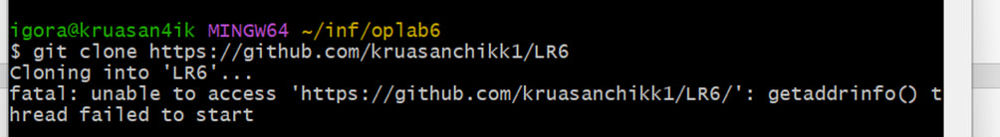
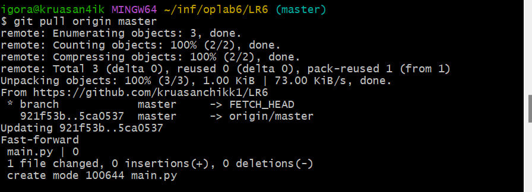
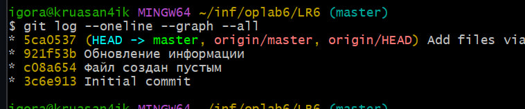
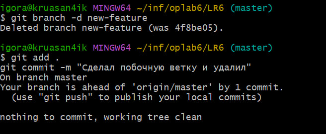
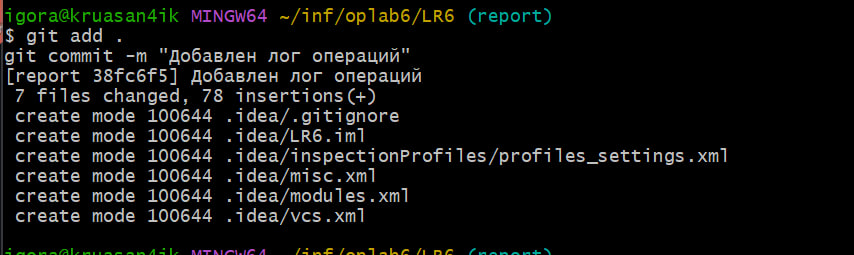

# LR6
Лабораторная работа №6
# Отчет по работе с Git

## 1. Создание форка
Сделана копия в личное хранилище из https://github.com/kruasanchikk1/LR6

## 2. Настройка клиента git
Команда для изменения имени пользователя:

```bash
$ git config --global user.name "4318 Алексеев И. С."
```
Команда для изменения почты пользователя:

```bash
$ git config --global user.email "egorkalvlup7@gmail.com"
```


## 3. Клонирование репозитория

```bash
$ git clone https://github.com/kruasanchikk1/LR6
```
*Скриншот клонирования* 



## 4. Добавление нового файла
*Добавляем новый файл*

## 5. Добавление изменений в локальный репозиторий

```bash
$ git pull origin main
```
*Изменения данных в локальном репозитории*




## 6. Получение данных для каждой из веток

```bash
$ git log --oneline --graph --all

```
*Результат работы команды*




## 7. Просмотр последних изменений

```bash
$ git status
```
*Результат работы команды*

## 8. Создание новой ветки
*Результат добавления новой ветки*
```bash
$ git checkout -b new-feature
```


## 9. Слияние веток

```bash
$ git merge new-feature
```
*Выполнено слияние веток*


## 10. Удаление побочной ветки после слияния

```bash
$ git branch -d new-feature
```
*Удалил побочную ветку*




## 11. Сделал несколько изменений, закоммитив их с комментариями

*Скриншот коммитов*


*Запушил коммиты*

## 12. Откат коммита
Удаление последнего коммита с помощью команды:

```bash
$ git reset --soft HEAD~1
```
*Скриншот отката*



## 13. Получение истории операций в форматированном виде

```bash
$ git git log --oneline --pretty=format:"%h %ad | %s | %an" --date=short
```

## 14. История операций
Список истории операций:
```
* 5ca0537 (HEAD -> master, origin/master, origin/HEAD) Add files via upload
* 921f53b Обновление информации
* c08a654 Файл создан пустым
* 3c6e913 Initial commit

```

## 15. Вывод
В ходе выполнения работы я повторил базовые возможности системы управления версиями, получил опыт работы с Git Api, опыт работы с локальным и удаленным репозиторием.
